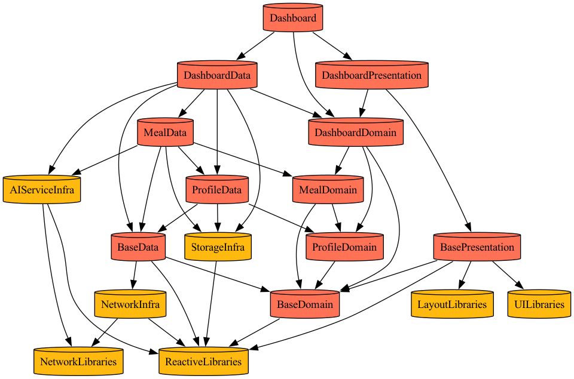

# SimpleCare

AI 기반 개인 건강 관리 iOS 앱

---

## 제품 비전

사용자가 식단, 운동, 체중을 간편하게 기록하고 AI의 도움으로 건강한 생활 습관을 형성할 수 있도록 돕는 iOS 앱

---

## 기술 스택

| 분류 | 기술 | 비고 |
|-----|------|------|
| **플랫폼** | iOS 18.0+ | SwiftUI, SwiftData |
| **UI** | SwiftUI | 선언형 UI |
| **아키텍처** | Clean Architecture + TCA | Tuist 모듈화 |
| **상태 관리** | The Composable Architecture (TCA) | 단방향 데이터 흐름, Reducer 기반 |
| **데이터 저장** | SwiftData | Apple 네이티브 ORM |
| **차트** | Swift Charts | 네이티브 차트 라이브러리 |
| **AI** | OpenAI GPT-4o | 영양소 추정, 이미지 분석 |
| **빌드** | Tuist | 모듈화된 프로젝트 관리 |

---

## 주요 기능

- **AI 영양 분석**: 텍스트/사진 입력으로 음식 영양소 자동 추정
- **운동 기록**: MET 기반 칼로리 소모량 계산
- **체중 관리**: 목표 설정 및 추세 분석
- **대시보드**: 일일 영양/운동 요약 시각화

---

## 빠른 시작

```bash
# 1. 저장소 클론
git clone https://github.com/wnsgur9137/SimpleCare.git
cd SimpleCare

# 2. 프로젝트 생성
tuist install && tuist generate

# 3. Xcode에서 열기
open SimpleCare.xcworkspace
```

---

## 모듈 구조

### 전체 의존성 그래프


### Feature 모듈별 의존성

각 Feature 모듈은 Clean Architecture + TCA 패턴을 따르며, Data/Domain/Presentation 레이어로 구성됩니다.

#### Splash
앱 시작 시 표시되는 스플래시 화면


#### Onboarding
사용자 프로필 및 목표 설정


#### Home (Tab Coordinator)
메인 탭 네비게이션 관리


#### Dashboard
일일 영양/운동 요약 대시보드



#### Meal
AI 기반 식단 기록 및 영양 분석


#### Exercise
MET 기반 운동 기록 및 칼로리 계산


#### Weight
체중 기록 및 목표 관리


#### Profile
사용자 프로필 관리


#### Settings
앱 설정


---

## 아키텍처

### Clean Architecture + TCA

```
┌─────────────────────────────────────────────────────────┐
│                    Presentation                         │
│  ┌─────────────┐  ┌─────────────┐  ┌─────────────┐     │
│  │    View     │→ │   Reducer   │→ │ Coordinator │     │
│  │  (SwiftUI)  │  │ (TCA Store) │  │             │     │
│  └─────────────┘  └─────────────┘  └─────────────┘     │
├─────────────────────────────────────────────────────────┤
│                      Domain                             │
│  ┌─────────────┐  ┌─────────────┐  ┌─────────────┐     │
│  │   Entity    │  │  Use Case   │  │  Repository │     │
│  │             │  │             │  │  Protocol   │     │
│  └─────────────┘  └─────────────┘  └─────────────┘     │
├─────────────────────────────────────────────────────────┤
│                       Data                              │
│  ┌─────────────┐  ┌─────────────┐  ┌─────────────┐     │
│  │ Repository  │  │    Model    │  │ Data Source │     │
│  │    Impl     │  │   (DTO)     │  │             │     │
│  └─────────────┘  └─────────────┘  └─────────────┘     │
├─────────────────────────────────────────────────────────┤
│                   Infrastructure                        │
│  ┌─────────────┐  ┌─────────────┐  ┌─────────────┐     │
│  │StorageInfra │  │AIServiceInfra│ │ NetworkInfra│     │
│  │ (SwiftData) │  │  (OpenAI)   │  │   (Moya)    │     │
│  └─────────────┘  └─────────────┘  └─────────────┘     │
└─────────────────────────────────────────────────────────┘
```

### TCA 패턴

```
┌─────────────────────────────────────────────────────────┐
│                      View                               │
│                        │                                │
│                   send(Action)                          │
│                        ▼                                │
│  ┌─────────────────────────────────────────────────┐   │
│  │                   Reducer                        │   │
│  │  ┌───────┐    ┌────────┐    ┌────────────┐     │   │
│  │  │ State │ ←  │ Action │ →  │   Effect   │     │   │
│  │  └───────┘    └────────┘    └────────────┘     │   │
│  └─────────────────────────────────────────────────┘   │
│                        │                                │
│                  State 변경                              │
│                        ▼                                │
│                   View 업데이트                          │
└─────────────────────────────────────────────────────────┘
```

---

## 문서

자세한 기술 문서는 [docs/](./docs/) 폴더를 참고하세요.

| 문서 | 설명 |
|-----|------|
| [SETUP.md](./docs/SETUP.md) | 개발 환경 설정 가이드 |
| [ARCHITECTURE.md](./docs/ARCHITECTURE.md) | 프로젝트 아키텍처 설계 |
| [MODULES.md](./docs/MODULES.md) | 모듈 상세 정의 |
| [API.md](./docs/API.md) | AI API 연동 명세 |
| [PRD.md](./docs/PRD.md) | 제품 요구사항 문서 |
| [WORKPLAN.md](./docs/WORKPLAN.md) | 작업 계획서 |
| [ROADMAP.md](./docs/ROADMAP.md) | 개발 로드맵 및 진행 상황 |

---

## 면책 조항

> SimpleCare는 건강 관리를 돕기 위한 도구입니다.
> AI 추정치는 참고용이며 의료적 조언이 아닙니다.
> 건강 관련 결정은 반드시 전문가와 상담하세요.

---

## 라이선스

This project is for personal/educational use.
