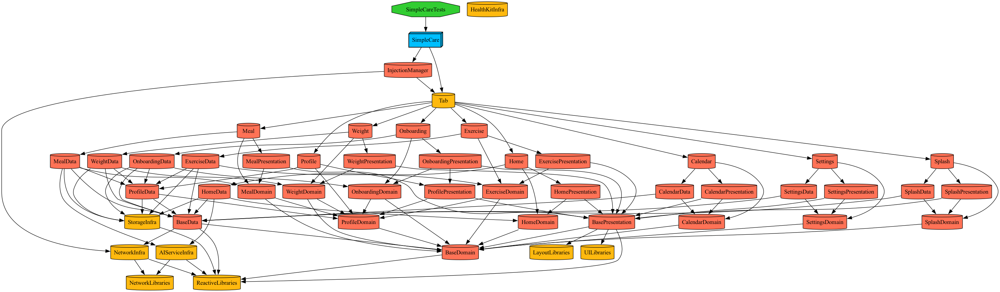
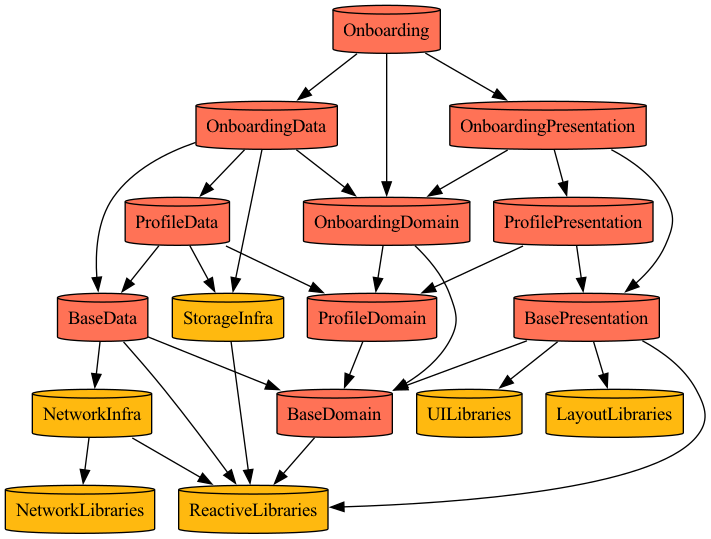
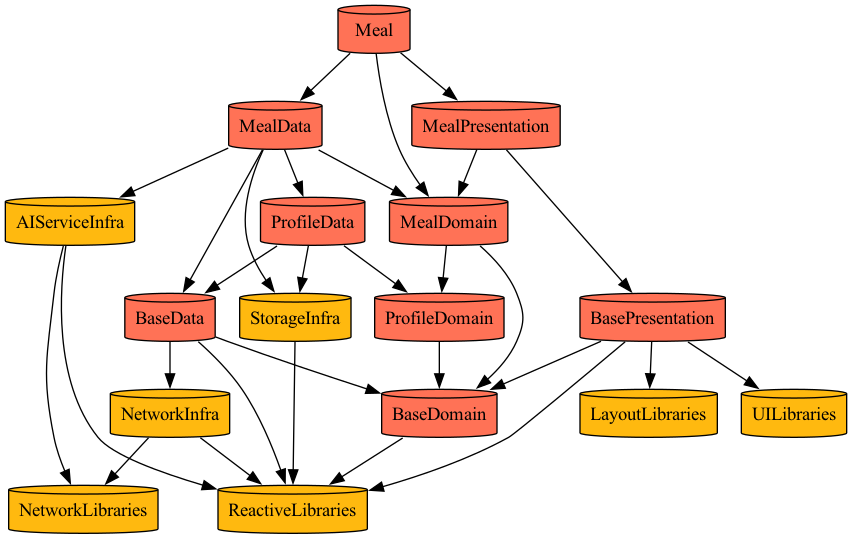
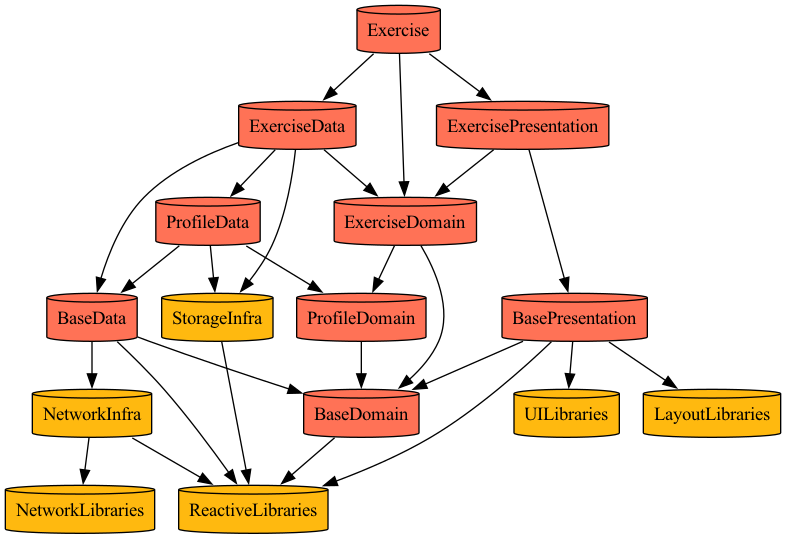
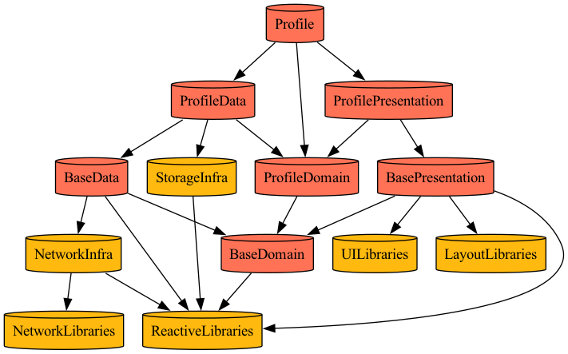
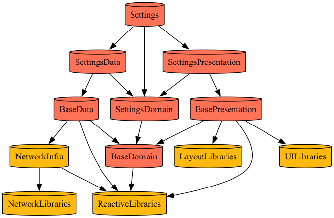
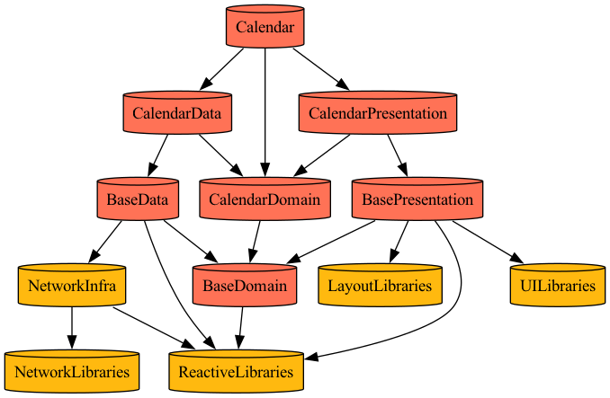

# SimpleCare

AI 기반 개인 건강 관리 iOS 앱

---

## 목차

1. [제품 비전](#제품-비전)
2. [기술 스택](#기술-스택)
3. [주요 기능](#주요-기능)
4. [빠른 시작](#빠른-시작)
5. [AI 개발 도구](#ai-개발-도구)
6. [모듈 구조](#모듈-구조)
7. [아키텍처](#아키텍처)
8. [문서](#문서)
9. [면책 조항](#면책-조항)
10. [라이선스](#라이선스)

---

## 제품 비전

사용자가 식단, 운동, 체중을 간편하게 기록하고 AI의 도움으로 건강한 생활 습관을 형성할 수 있도록 돕는 iOS 앱

---

## 기술 스택

| 분류 | 기술 |
|-----|------|
| **Platform** | iOS 18.0+, SwiftUI, SwiftData |
| **Architecture** | Clean Architecture + TCA |
| **Network** | Moya, Alamofire |
| **UI Components** | Kingfisher, Lottie, IQKeyboardManager |
| **AI** | OpenAI GPT-4o |
| **Build & CI/CD** | Tuist, Fastlane |

---

## 주요 기능

- **AI 영양 분석**: 텍스트/사진 입력으로 음식 영양소 자동 추정
- **운동 기록**: MET 기반 칼로리 소모량 계산
- **체중 관리**: 목표 설정 및 추세 분석
- **대시보드**: 일일 영양/운동 요약 시각화

---

## 빠른 시작

```bash
# 1. 저장소 클론
git clone https://github.com/wnsgur9137/SimpleCare.git
cd SimpleCare

# 2. 프로젝트 생성
tuist install && tuist generate

# 3. Xcode에서 열기
open SimpleCare.xcworkspace
```

---

## AI 개발 도구

본 프로젝트는 AI 도구를 적극 활용하여 개발 생산성과 코드 품질을 향상시키고 있습니다.

### PR 리뷰 자동화

| 도구 | 용도 |
|------|------|
| **Claude Code** | 코드 작성, 리팩토링, PR 생성, GitHub MCP 연동 |
| **Gemini Code Assist** | PR 생성 시 자동 코드 리뷰 수행 |

### AI 교차검증

단일 AI에 의존하지 않고, 여러 AI 모델을 활용하여 교차검증을 진행합니다.

- **ChatGPT** (OpenAI)
- **Claude** (Anthropic)
- **Gemini** (Google)

### MCP 서버 연동

Claude Code는 MCP(Model Context Protocol)를 통해 외부 서비스와 연동됩니다.

- **GitHub MCP**: Docker 기반으로 실행되며, PR/Issue 관리 기능 제공
- **Sosumi**: Apple Developer Documentation 검색
- **Shrimp Task Manager**: 태스크 관리 (GUI 지원)

> 자세한 내용은 [AI_TOOLS.md](./docs/AI_TOOLS.md)를 참고하세요.

---

## 모듈 구조

### 전체 의존성 그래프



### Feature 모듈별 의존성

각 Feature 모듈은 Clean Architecture + TCA 패턴을 따르며, Data/Domain/Presentation 레이어로 구성됩니다.

#### Splash
앱 시작 시 표시되는 스플래시 화면


#### Onboarding
사용자 프로필 및 목표 설정



#### Home (Tab Coordinator)
메인 탭 네비게이션 관리


#### Meal
AI 기반 식단 기록 및 영양 분석



#### Exercise
MET 기반 운동 기록 및 칼로리 계산



#### Weight
체중 기록 및 목표 관리


#### Profile
사용자 프로필 관리



#### Settings
앱 설정



#### Calendar
월별 캘린더 및 일별 요약



---

## 아키텍처

### Clean Architecture + TCA

```
┌─────────────────────────────────────────────────────────┐
│                    Presentation                         │
│  ┌─────────────┐  ┌─────────────┐  ┌─────────────┐     │
│  │    View     │→ │   Reducer   │→ │ Coordinator │     │
│  │  (SwiftUI)  │  │ (TCA Store) │  │             │     │
│  └─────────────┘  └─────────────┘  └─────────────┘     │
├─────────────────────────────────────────────────────────┤
│                      Domain                             │
│  ┌─────────────┐  ┌─────────────┐  ┌─────────────┐     │
│  │   Entity    │  │  Use Case   │  │  Repository │     │
│  │             │  │             │  │  Protocol   │     │
│  └─────────────┘  └─────────────┘  └─────────────┘     │
├─────────────────────────────────────────────────────────┤
│                       Data                              │
│  ┌─────────────┐  ┌─────────────┐  ┌─────────────┐     │
│  │ Repository  │  │    Model    │  │ Data Source │     │
│  │    Impl     │  │   (DTO)     │  │             │     │
│  └─────────────┘  └─────────────┘  └─────────────┘     │
├─────────────────────────────────────────────────────────┤
│                   Infrastructure                        │
│  ┌─────────────┐  ┌─────────────┐  ┌─────────────┐     │
│  │StorageInfra │  │AIServiceInfra│ │ NetworkInfra│     │
│  │ (SwiftData) │  │  (OpenAI)   │  │   (Moya)    │     │
│  └─────────────┘  └─────────────┘  └─────────────┘     │
└─────────────────────────────────────────────────────────┘
```

### TCA 패턴

```
┌─────────────────────────────────────────────────────────┐
│                      View                               │
│                        │                                │
│                   send(Action)                          │
│                        ▼                                │
│  ┌─────────────────────────────────────────────────┐   │
│  │                   Reducer                        │   │
│  │  ┌───────┐    ┌────────┐    ┌────────────┐     │   │
│  │  │ State │ ←  │ Action │ →  │   Effect   │     │   │
│  │  └───────┘    └────────┘    └────────────┘     │   │
│  └─────────────────────────────────────────────────┘   │
│                        │                                │
│                  State 변경                              │
│                        ▼                                │
│                   View 업데이트                          │
└─────────────────────────────────────────────────────────┘
```

---

## 문서

자세한 기술 문서는 [docs/](./docs/) 폴더를 참고하세요.

| 문서 | 설명 |
|-----|------|
| [SETUP.md](./docs/SETUP.md) | 개발 환경 설정 가이드 |
| [ARCHITECTURE.md](./docs/ARCHITECTURE.md) | 프로젝트 아키텍처 설계 |
| [MODULES.md](./docs/MODULES.md) | 모듈 상세 정의 |
| [API.md](./docs/API.md) | AI API 연동 명세 |
| [PRD.md](./docs/PRD.md) | 제품 요구사항 문서 |
| [WORKPLAN.md](./docs/WORKPLAN.md) | 작업 계획서 |
| [HOME_SCREEN_PLAN.md](./docs/HOME_SCREEN_PLAN.md) | 홈 화면 계획서 |
| [ROADMAP.md](./docs/ROADMAP.md) | 개발 로드맵 및 진행 상황 |
| [AI_TOOLS.md](./docs/AI_TOOLS.md) | AI 도구 활용 가이드 |
| [FASTLANE.md](./docs/FASTLANE.md) | Fastlane 가이드 |
| [CLAUDE_CODE_GUIDE.md](./docs/CLAUDE_CODE_GUIDE.md) | Claude Code 설정 가이드 |
| [OMC_GUIDE.md](./docs/OMC_GUIDE.md) | oh-my-claudecode(OMC) 멀티 에이전트 가이드 |

---

## Claude Code 설정

이 프로젝트는 Claude Code를 활용한 AI 기반 개발 워크플로우를 지원합니다.

### 프로젝트 컨텍스트

`CLAUDE.md` 파일이 프로젝트 루트에 위치하며, Claude Code가 대화 시작 시 자동으로 읽어들여 프로젝트 구조, 컨벤션, 명령어 등을 파악합니다.

### 커스텀 슬래시 명령

`.claude/commands/` 디렉토리에 등록된 명령어:

| 명령어 | 기능 |
|--------|------|
| `/build` | Tuist 프로젝트 생성 + 빌드 검증 |
| `/version [type]` | 앱 버전 관리 (major/minor/patch/build/current) |
| `/new-feature [이름]` | Clean Architecture 기반 새 Feature 모듈 스캐폴딩 |
| `/review` | main 대비 변경사항 코드 리뷰 |
| `/test` | 유닛 테스트 실행 + 결과 분석 |

> 자세한 내용은 [CLAUDE_CODE_GUIDE.md](./docs/CLAUDE_CODE_GUIDE.md)를 참고하세요.

---

## 면책 조항

> SimpleCare는 건강 관리를 돕기 위한 도구입니다.
> AI 추정치는 참고용이며 의료적 조언이 아닙니다.
> 건강 관련 결정은 반드시 전문가와 상담하세요.

---

## 라이선스

This project is for personal/educational use.
